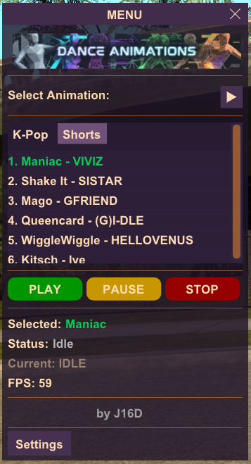
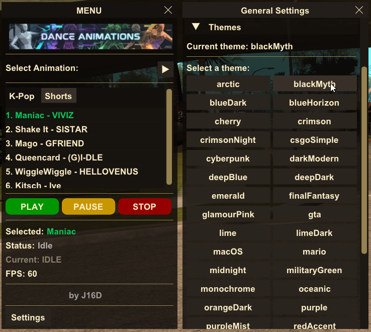

# Dance Loader by J16D

A comprehensive dance animation system for GTA San Andreas with synchronized music playback, multiple camera support, and an intuitive ImGui interface.

## 🎮 Features

- **10 Pre-configured Dance Animations** with synchronized music and camera movements
- **30+ Built-in UI Themes** for interface customization
- **Multiple Camera Angles** per animation with smooth transitions
- **Real-time Progress Bar** showing elapsed time in MM:SS format
- **Category-based Animation Organization** (K-Pop, Shorts, and more)
- **Per-animation Settings** including delays, camera offsets, and custom configurations
- **Easy-to-use Interface** built with ImGuiRedux
- **Modular Architecture** for easy addition of custom dances

## 📋 Requirements

- **GTA San Andreas v1.0** (US)
- **[CLEO Redux 1.4.2](https://re.cleo.li/)** by Seeman
- **[ImGuiRedux](https://github.com/user-grinch/ImGuiRedux)** by Grinch
- **[CLEO+ v1.2.0](https://www.mixmods.com.br/2023/10/cleoplus)** by Junior_Djjr
- **[ModLoader v0.3.7](https://www.mixmods.com.br/2018/01/modloader)** by LINK/2012

## 🚀 Quick Start

1. Install CLEO Redux 1.4.2, ImGuiRedux and CLEO+ v1.2.0
2. Download Dance Loader files
3. Extract to your GTA San Andreas directory
4. Launch the game and press `F4` to open the menu

For detailed installation instructions, see the [Installation Guide](../../wiki/Installation).

## 📖 Documentation

- **[Installation Guide](../../wiki/Installation)** - Step-by-step setup instructions
- **[How to Use](../../wiki/How-to-Use)** - Complete interface and controls guide
- **[Distribute Your Dances](../../wiki/Distribute-Dances)** - Create and share custom animations
- **[Custom Themes](../../wiki/Custom-Themes)** - Add your own UI themes

## 🎨 Screenshots

*30+ themes available*

*Customizable progress bar*

## 🎵 Included Animations

1. **Maniac** - VIVIZ
2. **Shake It** - SISTAR
3. **Mago** - GFRIEND
4. **Fifty Fifty** - CUPID
5. **Queencard** - (G)I-DLE
6. **WiggleWiggle** - HELLOVENUS
7. **Crab Rave** - Noisestorm
8. **Bibbidiba** - Hoshimachi Suisei
9. **Kitsch** - IVE
10. **For those who adore 105°C** - [A Si]

Each animation includes:
- Custom IFP animation file
- Synchronized MP3 audio
- Multiple camera animations (JSON)
- Individual configuration (INI)

## 🛠️ Technical Details

**Built with:**
- JavaScript
- CLEO Redux 1.4.2 for script execution
- ImGuiRedux for user interface
- Modular architecture for easy customization

**Core Modules:**
- `index.js` - Main entry point and initialization
- `ImGuiCore.js` - Theme management and UI framework
- `ImGuiThemes.js` - 30+ pre-defined themes
- `camCore.js` - Camera animation system
- `configLoader.js` - Animation configuration loader
- `iniManager.js` - INI file handler
- `ProgressBar.js` - Progress display with elapsed time

## 👤 Author

**J16D**

- YouTube: [youtube.com/j16d](https://www.youtube.com/j16d)
- Patreon: [patreon.com/J16D](https://www.patreon.com/c/J16D)

## 📝 Credits

- **CLEO Redux** by [Seeman](https://re.cleo.li/)
- **ImGuiRedux** by [Grinch](https://github.com/user-grinch/ImGuiRedux)
- **Dance Animations** from various K-Pop and music sources
- **Developed by** J16D

## 📄 License

This project is released for the GTA San Andreas modding community. Feel free to use, modify, and distribute with proper credits.

---

For support, tutorials, and updates, visit my [YouTube channel](https://www.youtube.com/j16d) or support the project on [Patreon](https://www.patreon.com/c/J16D).

